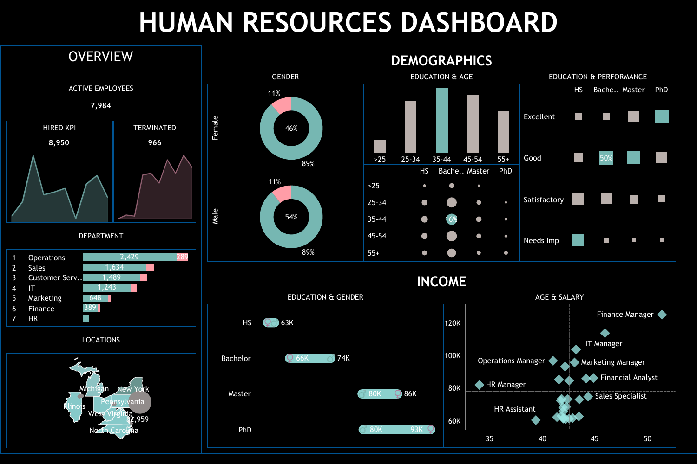
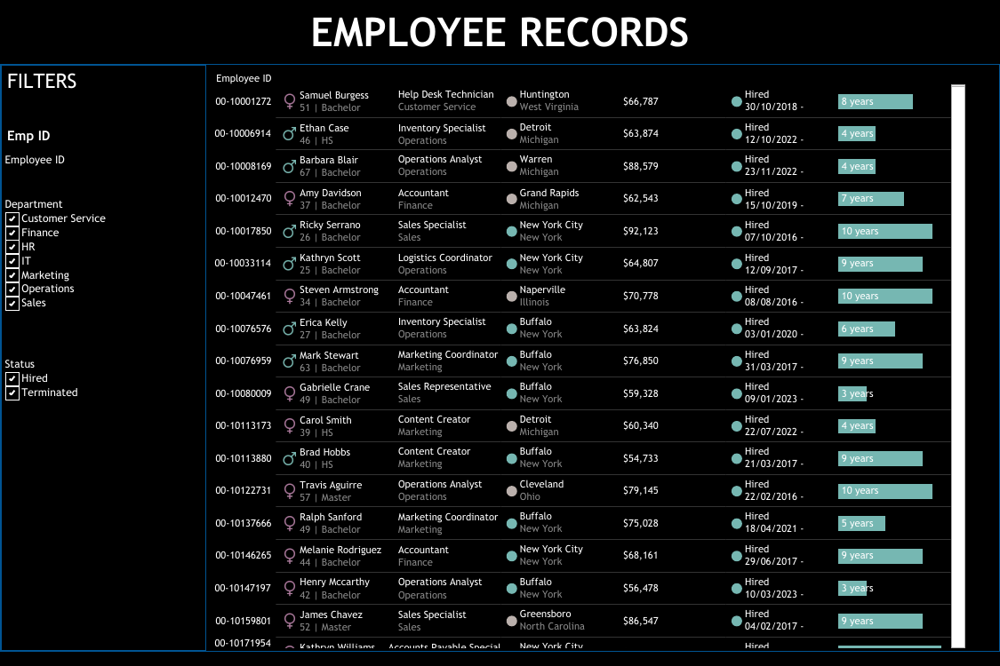

# HR Analytics Dashboard

A Tableau dashboard analyzing an 8,950-record employee dataset covering headcount, attrition, demographics, compensation, and performance across a 7-department, 8-state workforce (2015–2024).



## Key Metrics

| Metric | Value |
|---|---:|
| Total employee records | 8,950 |
| Active employees | 7,984 (89.2%) |
| Terminated employees | 966 (10.8%) |
| Departments | 7 |
| States represented | 8 |
| Data window | 2015–2024 |
| Gender split | 54% Male / 46% Female |
| Average salary | $70,951 |
| Avg. tenure (active) | 6.5 years |

A full breakdown by department, education, tenure, and compensation is available in the dashboard above.

## Dataset

- **File:** [`data/dataset.csv`](data/dataset.csv) — 8,950 rows, semicolon-delimited
- **Fields:** Employee ID, First/Last Name, Gender, State, City, Education Level, Birthdate, Hire Date, Termination Date, Department, Job Title, Salary, Performance Rating
- **Note:** Names in this file are synthetic/sample data generated for portfolio and learning purposes — not real employee records.

## Employee Records (detail view)



A filterable, row-level view of every employee — ID, name, age, education, role, department, location, salary, hire status, and tenure — with filters by department and employment status.

## Tech stack

- **Visualization:** Tableau (Tableau Public)
- **Data:** CSV, processed with Python/pandas for the metrics above
- **Source data:** [`data/dataset.csv`](data/dataset.csv)

## Repository structure

```
hr-analytics-dashboard/
├── README.md
├── data/
│   └── dataset.csv              # source data (8,950 employee records)
├── images/
│   ├── hr-summary-dashboard.png # dashboard: overview, demographics, income
│   └── employee-records-dashboard.png  # dashboard: row-level employee detail
├── HRSummary.pdf                 # original dashboard export (PDF)
└── EmpRecords.pdf                 # original dashboard export (PDF)
```

## Reproducing the metrics

The figures above were derived directly from `data/dataset.csv` with pandas:

```python
import pandas as pd

df = pd.read_csv("data/dataset.csv", sep=";")
df["Termdate"] = pd.to_datetime(df["Termdate"], format="%d/%m/%Y", errors="coerce")
df["Status"] = df["Termdate"].isna().map({True: "Active", False: "Terminated"})

attrition_rate = (df["Status"] == "Terminated").mean() * 100
print(f"Attrition rate: {attrition_rate:.2f}%")
```

## Author

**Sree Malathik**
[GitHub](https://github.com/Sreemalathi) · [LinkedIn](https://linkedin.com/in/sree-malathik)

Built as part of the WBS Coding School Data Analytics with AI bootcamp.
